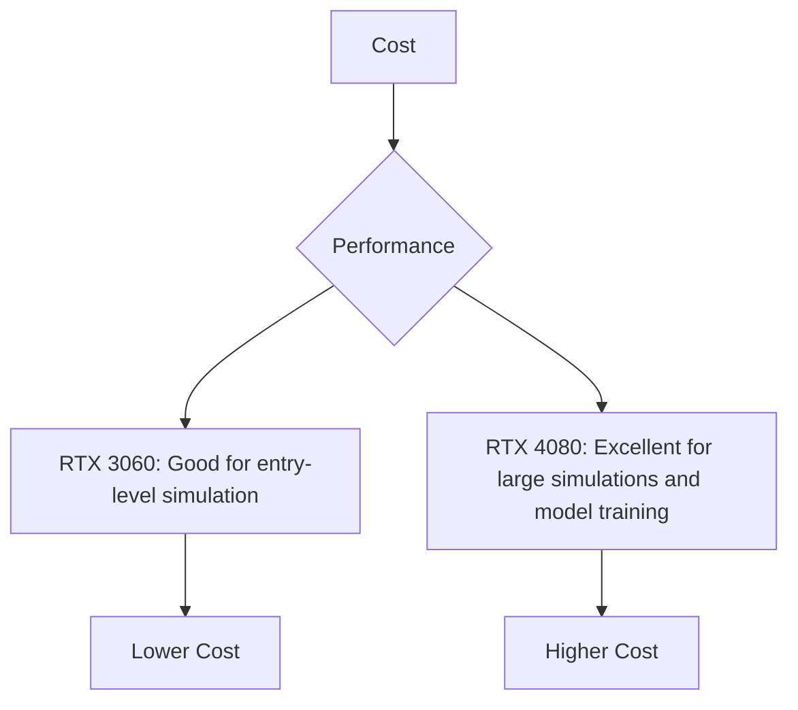
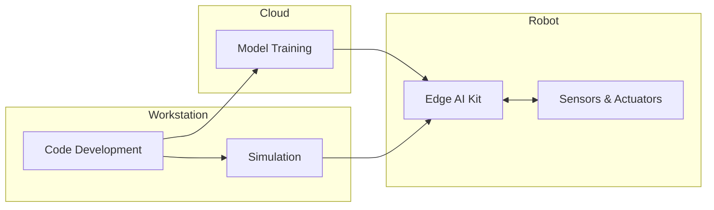

# Hardware Requirements

Building and experimenting with Physical AI and Humanoid Robotics requires a combination of computing hardware for development, simulation, and deployment. This guide outlines the recommended hardware configurations, from a basic workstation to a full-fledged robot lab.

## Workstation Configuration

Your primary development machine is where you will write code, run simulations, and train AI models. A powerful workstation is essential for a smooth workflow.

| Component         | Minimum Specification                  | Recommended Specification                | Estimated Cost |
| ----------------- | -------------------------------------- | ---------------------------------------- | -------------- |
| **CPU**           | Intel Core i7 / AMD Ryzen 7            | Intel Core i9 / AMD Ryzen 9              | $400 - $800    |
| **GPU**           | NVIDIA GeForce RTX 3060 (12GB VRAM)    | NVIDIA GeForce RTX 4080 (16GB+ VRAM)     | $400 - $1200   |
| **RAM**           | 32 GB DDR4                             | 64 GB DDR5                               | $100 - $300    |
| **Storage**       | 1 TB NVMe SSD                          | 2 TB NVMe SSD + 4 TB HDD                 | $100 - $400    |
| **Operating System** | Ubuntu 22.04 LTS (Dual boot with Windows recommended) | Ubuntu 22.04 LTS                        | -              |

### Cost-Performance Tradeoffs

## Edge AI Kit

For deploying AI models on a physical robot, you'll need an edge computing device. These are small, power-efficient computers with a GPU for accelerating AI inference.

| Component         | Description                                       | Recommended Model      | Estimated Cost |
| ----------------- | ------------------------------------------------- | ---------------------- | -------------- |
| **SBC**           | Single Board Computer with integrated GPU         | NVIDIA Jetson AGX Orin | $1000 - $2000  |
| **Power Supply**  | 19V DC Power Supply                               | Included with kit      | -              |
| **Storage**       | 64 GB eMMC + 1 TB NVMe SSD                        | -                      | $100           |
| **Peripherals**   | USB Camera, Wi-Fi module                          | -                      | $50 - $100     |

## Robot Lab

A dedicated robot lab is essential for hands-on learning and experimentation. This includes a robot platform and a safe area for testing.

| Component              | Description                                       | Recommended Model                 | Estimated Cost   |
| ---------------------- | ------------------------------------------------- | --------------------------------- | ---------------- |
| **Robot Platform**     | A mobile robot or robot arm                       | TurtleBot 4 / Franka Emika Panda  | $1,500 - $20,000 |
| **Sensors**            | LiDAR, Depth Camera, IMU                          | Included with robot               | -                |
| **Workspace**          | A clear, open area for robot operation            | -                                 | -                |
| **Safety Equipment**   | Emergency stop button, physical barriers        | -                                 | $100 - $500      |

## Cloud Computing Option

For intensive tasks like training large AI models or running complex simulations, cloud computing resources can be a cost-effective alternative to a powerful workstation.

| Service Provider | Recommended Services                               | Estimated Cost (per hour) |
| ---------------- | -------------------------------------------------- | ------------------------- |
| **AWS**          | EC2 P3/G4 instances, Amazon SageMaker              | $1 - $5                   |
| **Google Cloud** | Compute Engine with NVIDIA GPUs, AI Platform       | $1 - $5                   |
| **Azure**        | NC-series Virtual Machines, Azure Machine Learning | $1 - $5                   |

## Summary Architecture

The following diagram illustrates how the different hardware components work together in a typical development workflow.

